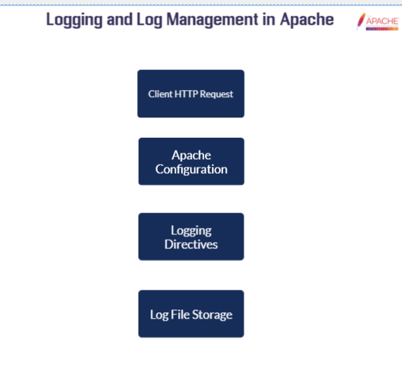
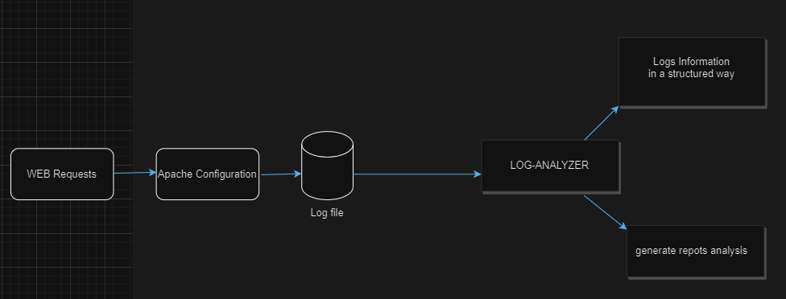

**LOG ANALYZER PROJECT :**

- PART1: **INTRODUCTION**

In this blog, I'm going to explain in detail how I created a log analyzer from scratch. Before diving  deep into the technical terms, let's first explain the concept of analyzing web server logs and its role in system security.

In the field of cybersecurity, logs offer valuable insights into the current system status, troubleshooting ...

In context of web server, logs gives many informations such as :

- the client IP 
- the Request time
- the request method
- the request URL
- the User Agent 
- the URL size 

As we see Logs give us interesting information about what clients are asking for. This helps us spot problems like downtime or attacks. For cybersecurity engineers, it's important to keep checking these logs all the time. But since log files can be really long, with thousands of lines, it's hard to go through them manually. That's why automating the analysis of web server logs is a smart idea

- PART2: **APACHE  ACCESS LOGS** 
  
  
     
     

Apache access logs contains information about requests coming into the web server. 

    Location:
    /var/log/apache/access.log
    
    example : 
    10.185.248.71 - - [09/Jan/2015:19:12:06 +0000] 808840 "GET /inventoryService/inventory/purchaseItem?userId=20253471&itemId=23434300 HTTP/1.1" 500 17 "-" "Apache-HttpClient/4.2.6 (java 1.5)"
 

- PART3: **SOLUTION IDEA**

   My suggestted solution  was about creating a system ensuring these tasks :
   
   - Parsing log files  continuously

   - Extracting important information from each log line and organizing it into a data structure

   - Create Scripts that generate statistic informations from logs
   
   - Create a script that detect attacks from requests

   - Create a  web interface to shocase analysis results and generate reports

  **SOLUTION  MODELISATION**

    

- PART4: **SOLUTION IMPLEMNTATION**
