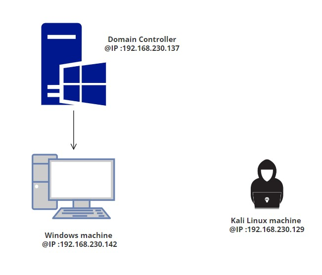

**LLMNR  POISONING**
  - In this blog  i'm  gonna explain one of the most used attack in active directory hacking.

    LLMNR  or LOCAL LINK MULTICAST NAME RESOLUTION  is a protocol used by windows machine to resolve the names of neighbouring computers without using a domain name system (DNS) server.To achieve this the windows machine sends multicast queries over local networks asking if any specific computers with certain names exist and whether any have responded with their IP addresses when queried by LLMNR.

    LLMNR poisoning is a man-in-the-middle (MITM) attack that exploits this protocol.An attacker send a poisned answer to the victim machine , forcing computers that ask for LLMNR information instead to communicate directly with the attacker instead of their intended targets , Once connected with them, attackers can capture sensitive data.
    
    Here is an example of LLMNR POISONING ATTACK :
    

**WALKTHROUGH**

In this section, I will demonstrate how a LLMNR POISONING attack can be utilized to acquire user credentials.

To accomplish this, I utilized an Active Directory lab environment. Below is the network architecture:

The initial step is to launch a responder on Kali Linux to intercept network traffic :

Once the responder has been configured, the next step involves initiating an SMB share on the Windows machine:

After starting  the SMB share on the domain, the Windows machine attempts to resolve this name using LLMNR. Subsequently, the Kali Linux machine sends a poisoned answer

and then  the poisoner asking for user credentials:

domain isn’t available at all! That’s just our poisoned answer in order to obtain NTLM hashes. Even if the user doesn’t input credentials, the hashes will be obtained:

after getting the hash value we will crack it using hashcat:

AND  WE GOT THE JOB DONE.